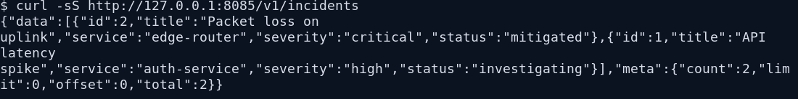

# incident-api

Project Go sederhana untuk mencatat dan mengelola incident operasional.

## Fitur

- REST API menggunakan `net/http`
- CRUD incident
- Penyimpanan data ke file JSON
- Health check
- Filter dan pagination
- Header `X-Request-ID`
- Test dasar

## Endpoint

- `GET /healthz`
- `GET /v1/incidents`
- `POST /v1/incidents`
- `PUT /v1/incidents/{id}`
- `DELETE /v1/incidents/{id}`

## Menjalankan Project

```bash
go run ./cmd/api
```

Secara default server berjalan di `:8080`.
Data akan disimpan di `data/incidents.json`.

Untuk ganti port:

```bash
PORT=8081 go run ./cmd/api
```

## Contoh Request

```bash
curl -X POST http://localhost:8080/v1/incidents \
  -H "Content-Type: application/json" \
  -d '{
    "title":"Packet loss on uplink",
    "service":"edge-router",
    "severity":"high",
    "status":"investigating",
    "description":"Packet loss above threshold",
    "owner":"noc-team"
  }'
```

## Contoh Filter

```bash
curl "http://localhost:8080/v1/incidents?status=investigating&service=auth-service&limit=5&offset=0"
```

## Contoh Output

```json
{
  "data": [
    {
      "id": 2,
      "title": "Packet loss on uplink",
      "service": "edge-router",
      "severity": "critical",
      "status": "mitigated"
    },
    {
      "id": 1,
      "title": "API latency spike",
      "service": "auth-service",
      "severity": "high",
      "status": "investigating"
    }
  ],
  "meta": {
    "count": 2,
    "limit": 0,
    "offset": 0,
    "total": 2
  }
}
```

## Terminal Snapshot


